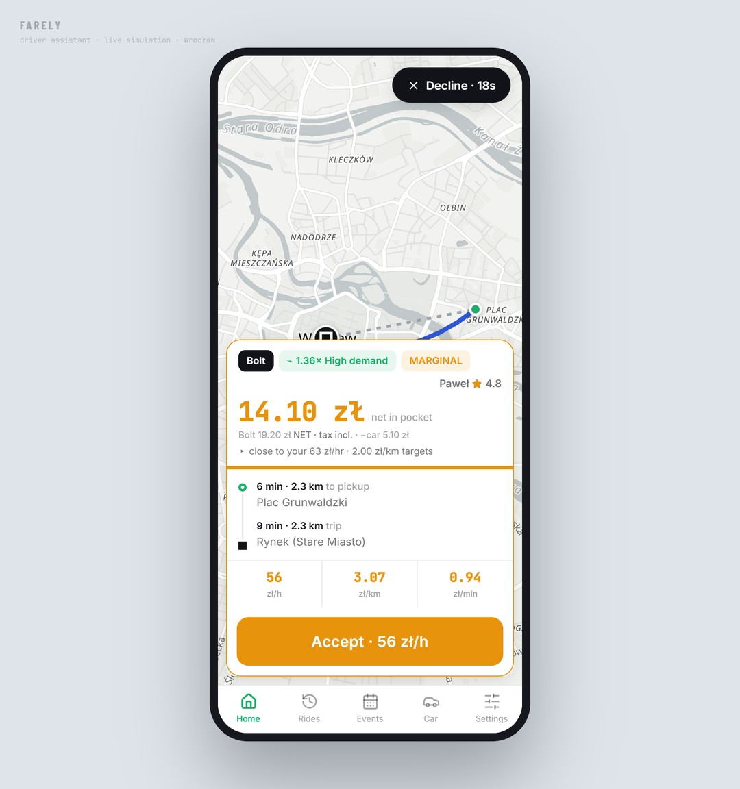
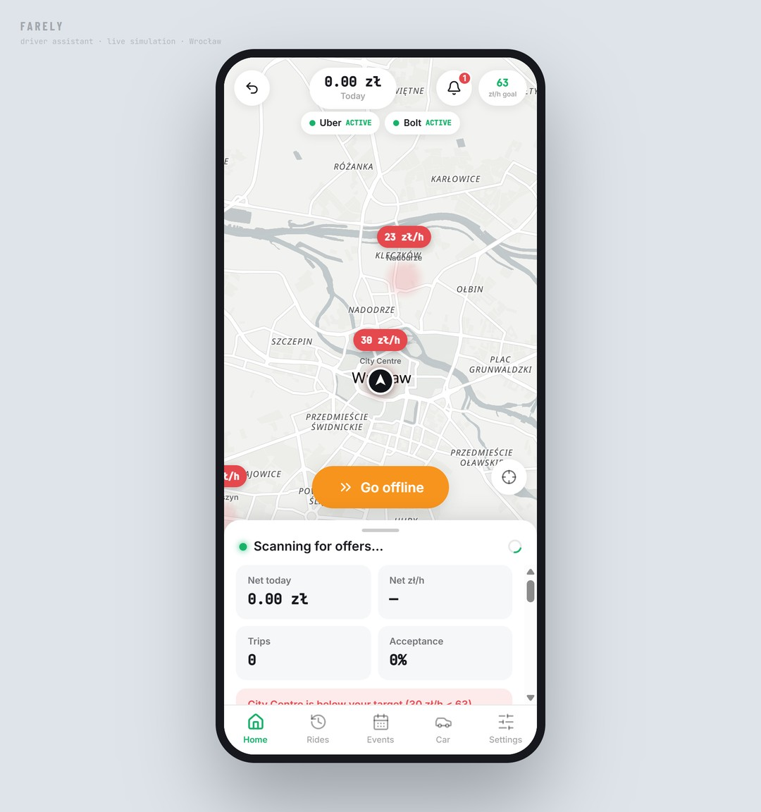
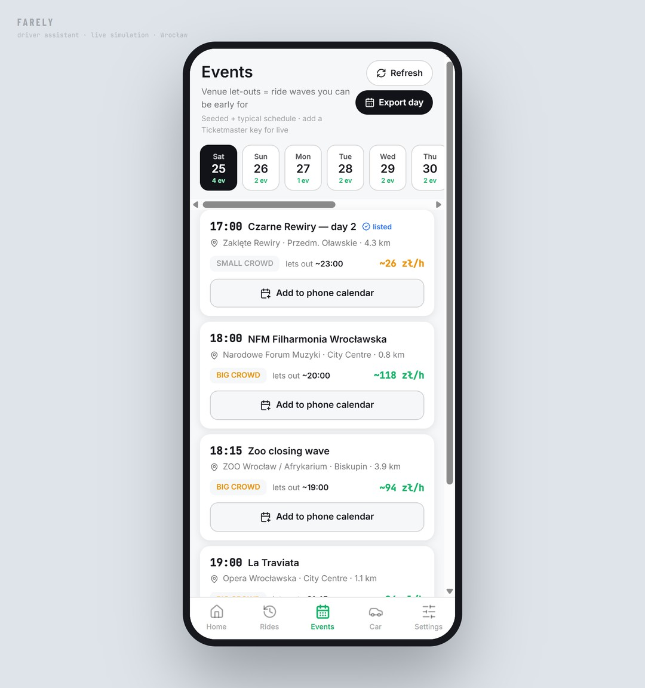
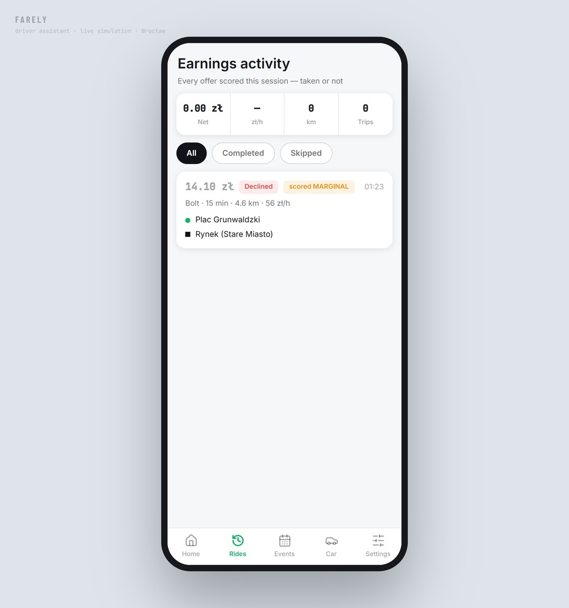
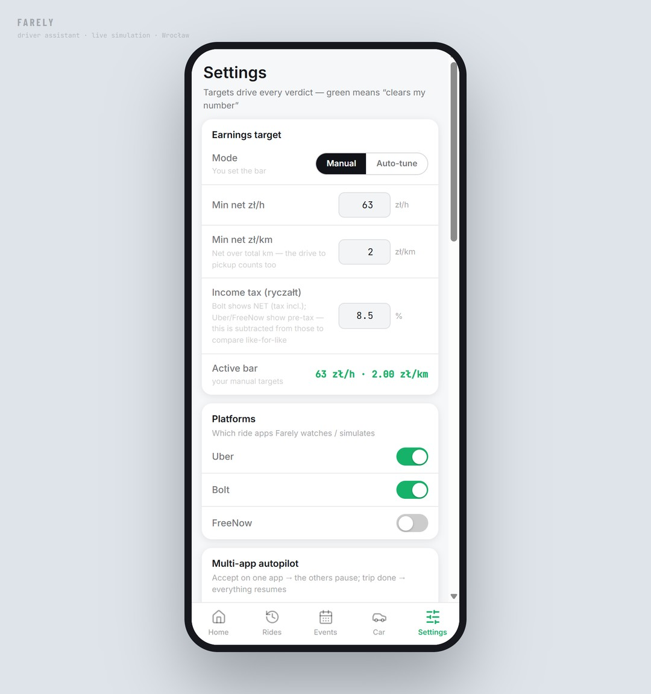
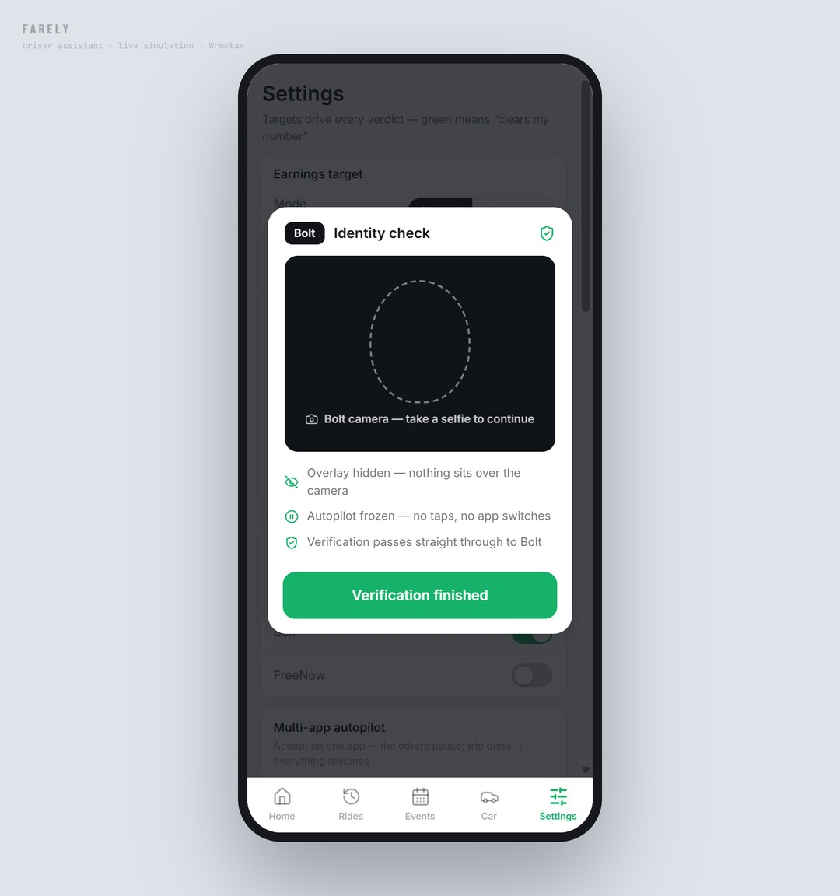

# Farely 🚗

> [!WARNING]
> **Personal prototype — for personal and educational purposes only.** Farely is a
> non-commercial learning/portfolio project. To score the driver's *own* ride offers it
> reads other apps' screens through Android accessibility, which **violates the Terms of
> Service of Bolt, Uber, FreeNow, and Google Play**. It is **not affiliated with, endorsed
> by, or connected to** any of those companies, and all product names and marks belong to
> their respective owners. This is not production software — do not run it on a driving
> account you are not prepared to lose. Use entirely at your own risk.

**A personal rideshare/delivery driver assistant for Wrocław, Poland.** Farely
reads the driver's *own* ride-app offers on-screen, scores each on **deadhead-adjusted
net profit** (PLN), says **ACCEPT / MARGINAL / DECLINE** in one glance, and keeps
steering toward the most profitable hours and places — while running the multi-app
"chore" autopilot for Bolt · Uber · FreeNow.

> Private, single-driver tool — not a product or SaaS. The north-star intent lives
> in [`docs/VISION.md`](docs/VISION.md); the full requirements in
> [`docs/SRS.md`](docs/SRS.md).

<p align="center">
  
</p>

<p align="center"><sub><b>The one-glance verdict.</b> A live offer scored on deadhead-adjusted take-home: <b>ACCEPT / MARGINAL / DECLINE</b>, the net <i>in pocket</i> after the platform's cut, income tax, and car costs — plus zł/h · zł/km · zł/min — before the accept timer runs out.</sub></p>

## Screenshots

The web UI tester (the same pure engine that ships inside the APK), driven end-to-end
through a simulated Wrocław shift — no mockups, real screens.

<table>
  <tr>
    <td width="50%" valign="top">
      
      <br><sub><b>Home.</b> Live Wrocław demand map — zone zł/h pills, your position, today's net and acceptance, and a nudge when the zone you're in drops below target.</sub>
    </td>
    <td width="50%" valign="top">
      
      <br><sub><b>Events.</b> Venue let-outs = ride waves. Each show's crowd size, let-out time, distance, and expected zł/h — exportable to the phone calendar so you can position early.</sub>
    </td>
  </tr>
  <tr>
    <td width="50%" valign="top">
      
      <br><sub><b>Rides.</b> An honest ledger of every offer scored this session — taken or skipped, the verdict it got, and the running net zł/h.</sub>
    </td>
    <td width="50%" valign="top">
      
      <br><sub><b>Targets &amp; tax.</b> The bar every verdict is measured against (manual or self-tuning), with income-tax normalization so Bolt's tax-included price compares like-for-like with Uber/FreeNow.</sub>
    </td>
  </tr>
  <tr>
    <td width="50%" valign="top">
      
      <br><sub><b>Safety first.</b> When a platform asks for a face/ID check, all automation freezes and the overlay hides — Farely never gets between the driver and a verification camera.</sub>
    </td>
    <td width="50%" valign="top"></td>
  </tr>
</table>

---

## Monorepo layout

```
farely/
├── apps/
│   ├── tester/     # UI Tester — the Vite/React web app + the pure domain engine
│   │               #   (this same build ships inside the APK's WebView)
│   └── android/    # the APK — Capacitor host + native Kotlin (gradle in ./android),
│                   #   accessibility capture, verdict overlay, coordinator, vision
├── docs/           # VISION, SRS, and the live-capture sub-project (ocr-overlay/)
├── package.json    # workspace root (npm workspaces + pnpm-workspace.yaml)
└── README.md
```

Two deliverables, **one shared core**: all business logic is pure and UI-free in
`apps/tester/src/app/lib/` — the web app renders it as a live simulation, and the
Android app runs the identical built bundle inside a WebView, fed by native capture.

| | UI Tester (`apps/tester`) | APK (`apps/android`) |
|---|---|---|
| Stack | Vite 6 · React 18 · TypeScript · Tailwind v4 | Capacitor 7 · Kotlin · Android (min SDK 23) |
| Offer feed | simulated Wrocław offers | real offers read off-screen (accessibility) |
| Purpose | develop, demo, and test the engine | drive with it on a real phone |

---

## Quick start

```bash
# from the repo root
pnpm install          # or: npm install  (pnpm matches the workspace design)

# ── UI Tester (web) ──
npm run dev           # Vite dev server → http://localhost:5173
npm run build         # → apps/tester/dist

# ── APK (Android) ──
npm run apk           # web build → cap copy → gradlew assembleDebug
#   → apps/android/android/app/build/outputs/apk/debug/app-debug.apk
```

Windows one-click helpers: **`Open-Farely.bat`** (web demo), **`Run-On-Emulator.bat`**
(APK on a virtual phone) and **`Install-To-Phone.bat`** (build + `adb install` to a
USB phone).

> Building the APK needs the Android SDK. `pnpm install` places
> `@capacitor/android` where the gradle project expects it; with plain npm you may
> need it under `apps/android/node_modules`.

**Step-by-step guides** (demo and installation are independent — pick one):

| Guide | What it covers |
|---|---|
| [`docs/guides/DEMO.md`](docs/guides/DEMO.md) | Web demo in the browser — zero Android setup, 5-minute feature tour |
| [`docs/guides/EMULATOR.md`](docs/guides/EMULATOR.md) | Run the real APK on a virtual phone + a precise verification checklist |
| [`docs/guides/ANDROID-INSTALL.md`](docs/guides/ANDROID-INSTALL.md) | Install on your own phone: prerequisites, USB install, first-run permissions, troubleshooting |

---

## What it does

1. **Offer decisions** — deadhead-adjusted net → ACCEPT/MARGINAL/DECLINE + one-line reason (`engine.ts`).
2. **Smart zoning** — live demand zones + a "move here" nudge with the expected zł/h.
3. **Earnings intelligence** — realized net zł/h, honest accept/decline history.
4. **Self-tuning** — thresholds adapt to real outcomes; manual zł/h override.
5. **Multi-app autopilot** — one active trip per app: pause/resume/switch the *other* apps (`coordinator.ts`). Never taps a ride offer's Accept.
6. **Learn-controls** — no ride app has a "pause", so the driver *teaches* Farely each app's real buttons once, matched by view-id (`controls.ts`).
7. **Unknown-screen handler** — a screen Farely can't recognize is read on-device (offline text recognition) and classified by a weighted-keyword heuristic, then decided and logged; identity checks freeze automation (`vision.ts`). *An optional cloud-vision path exists in the code but ships off — see privacy note.*
8. **Live events** — Wrocław let-outs from a built-in calendar (typical venue schedules + annual festivals, computed for any date), priced as demand, exportable to the phone calendar (`liveEvents.ts` / `events.ts`).
9. **Diagnostics DB** — an on-device "black box" (IndexedDB) of everything Farely does or trips over, reviewable and exportable for tuning (`diagnostics.ts` / `diagStore.ts`).
10. **Notifications** + a **LITE performance tier** for low-end phones.

---

## Privacy

Farely runs **fully on-device** — earnings, logs, screen reads, and normal operation
never leave the phone. Unknown screens are recognized on-device (the same offline text
recognition as Google Lens), so there's no cloud call, no account, and no setup.
**Identity/face-check screens are detected on-device and freeze all automation** — never
captured, never sent anywhere — and Farely never proposes tapping a ride offer's Accept.
Full rationale in [`VISION.md §5/§6`](docs/VISION.md).

Live events come from a **built-in Wrocław calendar** (typical venue schedules + annual
festivals, computed for any date). A cloud-vision classifier (Anthropic) for unusual
redesigns and a Ticketmaster live-events feed also exist in the code, but ship **off by
default** and aren't surfaced in the prototype's UI.

Reading platform screens likely violates the platforms' driver ToS — a personal-use
trade-off (see [VISION §7](docs/VISION.md) / [permissions & legal](docs/ocr-overlay/03-android-permissions-and-legal.md)).

---

## Architecture & docs
- [`docs/VISION.md`](docs/VISION.md) — the why (scope, non-goals, principles).
- [`docs/SRS.md`](docs/SRS.md) — full requirements + UML (component, class, sequence, state, ER).
- [`docs/ocr-overlay/`](docs/ocr-overlay/) — the live-capture sub-project (architecture, roadmap, permissions, changelog).

## License
[MIT](LICENSE).
