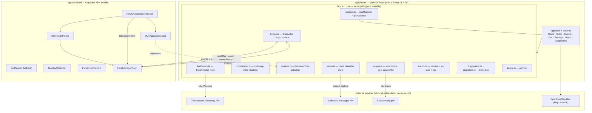
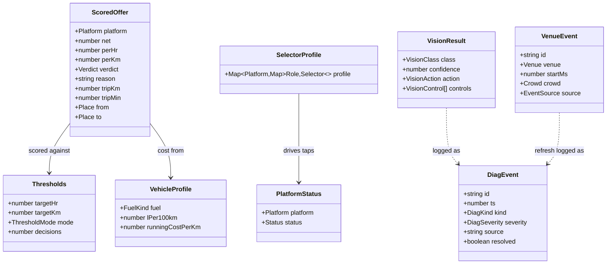
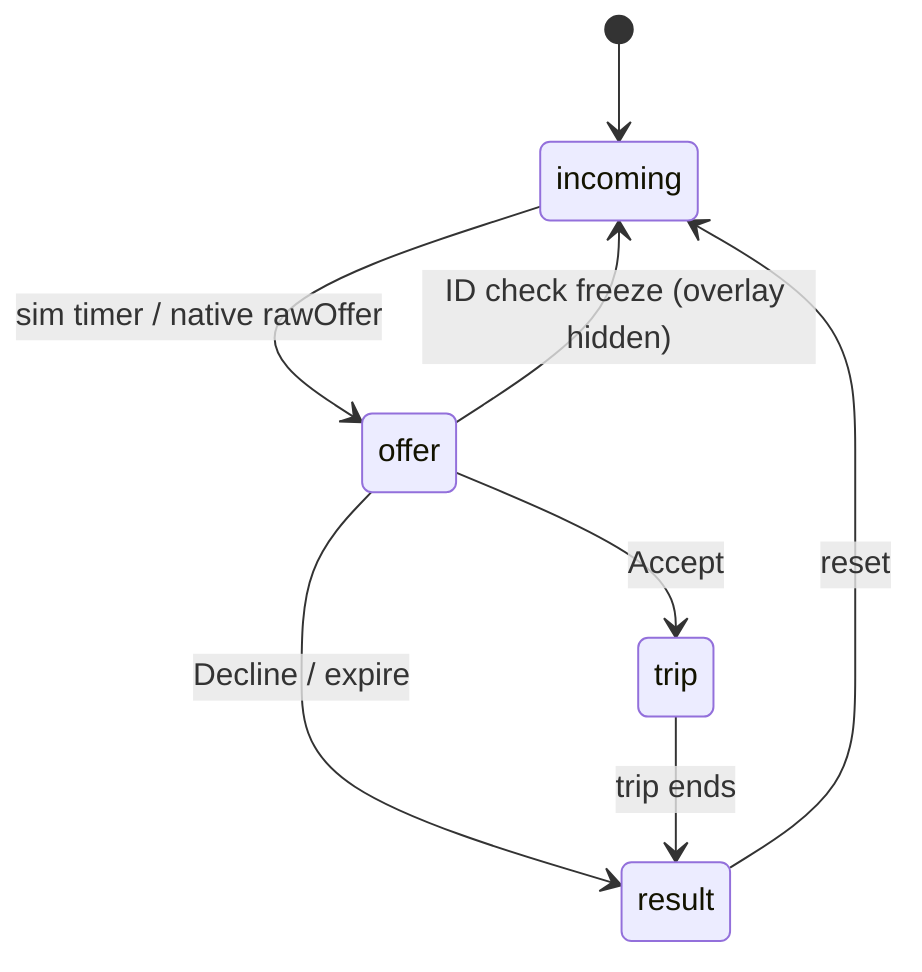
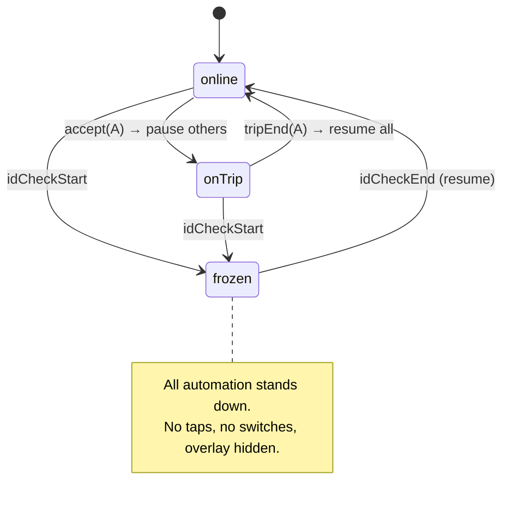
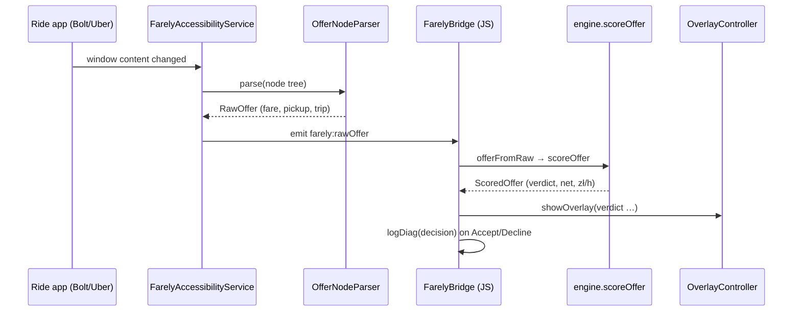
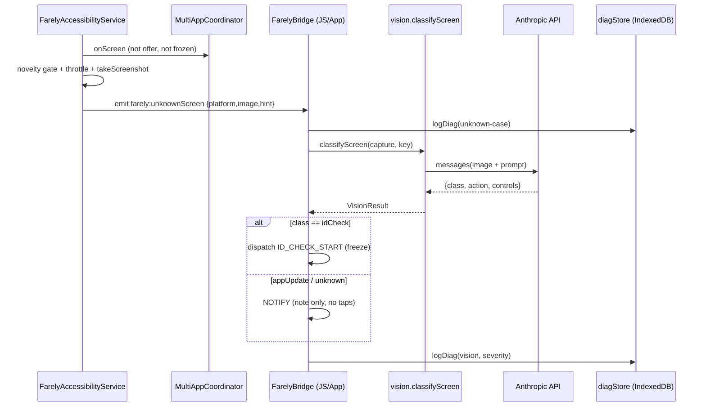
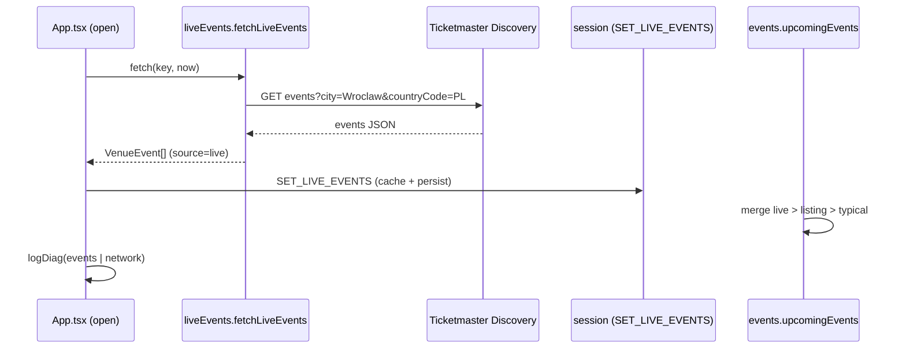
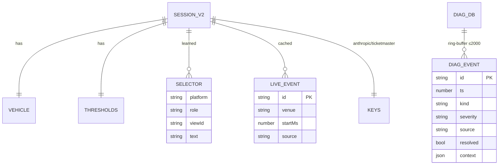

# Farely — Software Requirements Specification (SRS)

> Conforms to the structure of **ISO/IEC/IEEE 29148:2018** (IEEE 830 lineage).
> Scope: **both** deliverables — the **Android APK** (`apps/android`) and the
> **UI Tester** web app (`apps/tester`) — which share one pure domain core.
> Status: living document. Last revised 2026-07-13. Authoritative intent lives in
> [`VISION.md`](./VISION.md); phased status in [`ocr-overlay/02-roadmap.md`](./ocr-overlay/02-roadmap.md).

---

## 1. Introduction

### 1.1 Purpose
This SRS specifies the functional and non-functional requirements of **Farely**, a
personal rideshare/delivery **driver assistant** for Wrocław, Poland. It is the
reference for implementation, review, and verification across the two packages of
the monorepo. Readers: the developer (single maintainer), reviewers, and future
contributors.

### 1.2 Scope
Farely reads the driver's **own** ride-app screens on their **own** phone, scores
each offer on **deadhead-adjusted net profit** (PLN), advises **ACCEPT / MARGINAL /
DECLINE**, positions the driver toward higher-earning zones and venue let-outs, and
runs the multi-app "chore" autopilot (pause/resume/switch the *other* apps). It
never taps a ride offer's Accept and never interferes with an identity check.

Two deliverables, one core:

| Package | Role | Runtime |
|---|---|---|
| `apps/tester` | **UI Tester** — the full product as a client-side **simulation** + the entire pure domain engine that ships inside the APK's WebView | Vite + React 18 + TS, browser |
| `apps/android` | **APK** — Capacitor host + native Kotlin: accessibility capture, verdict overlay, multi-app coordinator, screenshot for vision, notifications | Capacitor 7, Android (min SDK 23) |

Out of scope (see [VISION §6](./VISION.md)): multi-city/multi-currency, iOS,
platform backend/API integration, auto-accept/decline of ride offers.

### 1.3 Definitions & acronyms
- **Offer** — an incoming ride/delivery request (fare, pickup, trip).
- **Deadhead** — unpaid distance/time driving to the pickup.
- **EpH / zł/h** — net earnings per hour (the headline metric).
- **Let-out** — a venue emptying (concert/match end) → a ride-demand wave.
- **Selector / SelectorProfile** — a per-app, per-role control locator (view-id first, text fallback) learned via Learn-controls.
- **Verdict** — `accept | marginal | decline`.
- **Unknown case** — a screen the on-device heuristics + learned selectors cannot classify.
- **Node tree** — the Android accessibility `AccessibilityNodeInfo` hierarchy.
- **LITE tier** — reduced-load rendering mode for low-end phones.

### 1.4 References
IEEE 830 / ISO-IEC-IEEE 29148; Android `AccessibilityService`; Capacitor 7;
Ticketmaster Discovery API v2; Anthropic Messages API; fueleconomy.gov REST;
`docs/VISION.md`; `docs/ocr-overlay/*`.

### 1.5 Overview
§2 gives the overall picture and UML models; §3 the numbered functional
requirements per subsystem + external interfaces + data; §4 the non-functional
requirements; §5 the business-logic appendix.

---

## 2. Overall description

### 2.1 Product perspective
Farely is a **self-contained personal tool**, not a SaaS. The pure domain core in
`apps/tester/src/app/lib/` is UI-free and side-effect-free; the web app renders it
as a simulation, and the **same built web bundle** runs inside the Android WebView,
where native Kotlin feeds it real captured data over the Capacitor `FarelyBridge`.



### 2.2 Product functions (summary)
1. **Offer decisioning** — parse → deadhead-adjusted net → verdict + one-line reason.
2. **Smart zoning** — live demand zones + "move here" nudge with expected zł/h.
3. **Earnings intelligence** — realized net zł/h, accept/decline history.
4. **Self-tuning** — thresholds adapt to real outcomes; manual override.
5. **Multi-app autopilot** — one-active-trip-per-app; pause/resume/switch chores.
6. **Learn-controls** — teach each app's real buttons (no "pause" exists).
7. **Cloud-vision unknown-case handling** — classify novel screens, decide, log.
8. **Live events calendar** — real Wrocław let-outs, phone-calendar export.
9. **Diagnostics DB** — on-device black box for later tuning.
10. **Notifications**, **LITE performance tier**.

### 2.3 User classes
Single user class: **the driver** (owner-operator). Sole actor; also the admin who
supplies API keys. No multi-tenant roles.

### 2.4 Operating environment
- **APK**: Android (min SDK 23 / target 36), Capacitor 7 WebView, Accessibility service enabled by the driver.
- **UI Tester**: any modern browser; desktop renders inside a phone frame.
- Region fixed to **Wrocław, PLN**.

### 2.5 Design & implementation constraints
- Pure domain logic isolated in `src/app/lib/` (UI-free, side-effect-free).
- `App.tsx` + screens use **inline styles + hex** (design tokens in `theme.ts`), not Tailwind/shadcn.
- Dependencies **exact-pinned**; `pnpm-workspace.yaml minimumReleaseAge: 10080` (refuse packages < 7 days old).
- No test runner/linter configured; correctness gated by builds + manual/browser verification.
- Persistence: `localStorage` (session) + `IndexedDB` (diagnostics) — no server, no accounts.

### 2.6 Assumptions & dependencies
- The driver accepts the ToS/ban risk of reading platform screens (their own account, their call — [VISION §7](./VISION.md)).
- External calls are **inbound public data** (events, car specs, map tiles) **except** the cloud-vision classifier, which sends a screen capture out under the driver's own key (opt-in scope change, [VISION §6](./VISION.md)).
- Ticketmaster / Anthropic keys are supplied by the driver and stored on-device only.

---

## 3. System models (UML)

### 3.1 Domain class model (selected)


### 3.2 Offer phase machine (`App.tsx`)


### 3.3 Multi-app coordinator state (`coordinator.ts` / `MultiAppCoordinator.kt`)


### 3.4 Sequence — offer to verdict (native)


### 3.5 Sequence — unknown screen to cloud vision to DB


### 3.6 Sequence — live events on app open


### 3.7 Data model — persisted state & stores (ER)

`SESSION_V2` = `localStorage["farely:session:v2"]`; `DIAG_DB` = IndexedDB
`farely-diag` / store `events`.

---

## 4. Specific requirements

Priority: **M** must / **S** should / **C** could. Verification: **T** test-in-sim,
**B** build, **D** on-device.

### 4.1 Offer engine — `engine.ts` (FR-OE)
- **FR-OE-0 (M/T)** Normalize the platform's shown price to real driver take-home (`driverTakeHome`/`PLATFORM_ECON`): the offer card is already net of commission on every platform, but Bolt is tax-included while Uber/FreeNow are pre-income-tax, so subtract the driver's `taxRate` (ryczałt) from the pre-tax platforms only.
- **FR-OE-1 (M/T)** Compute **net** = take-home (post-tax revenue) − running cost − deadhead cost, over trip + pickup legs, in PLN via `money()`.
- **FR-OE-2 (M/T)** Derive `perHr`, `perKm`, `perMin` from net over **total** time/distance (trip + deadhead) — deadhead km drags `perKm` down exactly as deadhead time drags `perHr` down.
- **FR-OE-3 (M/T)** Emit a `verdict` (`accept|marginal|decline`) vs the effective thresholds and a one-line plain `reason`.
- **FR-OE-4 (M/T)** `offerFromRaw` maps a native `RawOffer` (fuzzy `resolvePlace`, missing-field estimation) into a scorable offer, flagging `approx`.
- **FR-OE-5 (S/T)** `generateOffer` produces realistic Wrocław offers for the simulator when not native.

### 4.2 Smart zoning (FR-ZN)
- **FR-ZN-1 (M/T)** `liveZones`/`rankZones` rank zones by expected zł/h from `demandSignals` (time, transit, events, weather proxy).
- **FR-ZN-2 (M/T)** `moveSuggestion` charges repositioning time + fuel and only nudges when the destination clears the current zone by a margin.
- **FR-ZN-3 (S/T)** Venue let-outs (`eventSignals`) merge into the Home opportunities feed.

### 4.3 Earnings intelligence & self-tuning (FR-EI / FR-ST)
- **FR-EI-1 (M/T)** Maintain a decision `log`; session zł/h = net ÷ wall-clock (idle counts against the number).
- **FR-ST-1 (M/T)** `tuneThresholds` nudges the bar from real accept/decline outcomes in `auto` mode.
- **FR-ST-2 (M/T)** Manual mode honours the driver's zł/h and zł/km targets; `UNDO` rolls back money/thresholds/position.

### 4.4 Multi-app autopilot — `coordinator.ts` (FR-CO)
- **FR-CO-1 (M/T)** Deterministic `coordinate(statuses, event, settings)` enforces **one active trip per active app**.
- **FR-CO-2 (M/T)** On accept → pause others; on trip-end → resume all; app-switch brings the app needing the driver forward — each gated by a Settings toggle.
- **FR-CO-3 (M/D)** Never issues an Accept tap on a ride offer (only online/paused/foreground).
- **FR-CO-4 (M/T)** ID check sets `frozen`: all automation halts, overlay hidden, until `idCheckEnd`.
- **FR-CO-5 (M/D)** Native taps/reads via the **learned SelectorProfile** first (`present`/`clickRole`), heuristic labels only as fallback.

### 4.5 Learn-controls — `controls.ts` (FR-LC)
- **FR-LC-1 (M/D)** Capture the foreground app's node tree (`captureControls` → `farely:controlDump`) using `flagReportViewIds`.
- **FR-LC-2 (M/T)** Let the driver tag each node's role; persist a **view-id-first** `SelectorProfile`; `configureSelectors` pushes it native.
- **FR-LC-3 (M)** The driver may tag only online/offline/stop-requests + read-only markers — **never** a ride offer's Accept.

### 4.6 Cloud-vision unknown-case handler — `vision.ts` (FR-VI)
- **FR-VI-1 (M/T)** `classifyScreen(capture, key)` classifies `offer|trip|idCheck|appUpdate|unknown` via the Anthropic Messages API (strict-JSON prompt), with a deterministic keyword **mock fallback** when no key or on failure.
- **FR-VI-2 (M/T)** The App applies the verdict's `action`: `idCheck → freeze`, `appUpdate|unknown → note` (no taps), `map-control → offer to Learn-controls`. Never proposes an Accept tap.
- **FR-VI-3 (M/T/D)** Every unknown case and vision verdict is written to the diagnostics DB with evidence (class, confidence, controls, model).
- **FR-VI-4 (M/D)** Native emits `farely:unknownScreen` only on a genuinely new screen passing a **novelty gate**, hard-throttled per platform; **identity/face-check screens are never routed to the cloud** (handled on-device; `maybeEmitUnknown` bails when `frozen`).
- **FR-VI-5 (M)** The Anthropic key is user-supplied, stored on-device, never committed; the Settings field discloses that captures are sent to Anthropic.

### 4.7 Diagnostics DB — `diagnostics.ts` / `diagStore.ts` (FR-DB)
- **FR-DB-1 (M/T)** Persist events (`error|exception|decision|unknown-case|vision|coord|network|events`) to IndexedDB, ring-buffered to 2000 (in-memory fallback if IDB is unavailable).
- **FR-DB-2 (M/T)** `logDiag()` is the single fire-and-forget entry point; never throws; fires `farely:diag` for live UI refresh.
- **FR-DB-3 (M/T)** Capture points: `window.onerror`/`unhandledrejection`, every decision, network failures (`carLookup`, `liveEvents`), coordinator actions, vision verdicts.
- **FR-DB-4 (M/T)** DiagnosticsScreen filters by kind/severity/resolved + search, marks resolved, and exports the whole DB to JSON (download); Settings shows the open-case count.

### 4.8 Events — `events.ts` / `liveEvents.ts` (FR-EV)
- **FR-EV-1 (M/T)** On open (and on TM-key change) fetch Wrocław events from **Ticketmaster Discovery** and cache them; fail soft to seeded + typical.
- **FR-EV-2 (M/T)** `upcomingEvents` merges by provenance **live > listing > typical**; same-venue-within-6h counts as the same show.
- **FR-EV-3 (M/T)** Price each let-out with the map's `zoneEph`; EventsScreen shows live/listed badges, last-updated, and a manual refresh.
- **FR-EV-4 (S/D)** Export a positioning window to the phone calendar (`.ics` web / `CalendarContract` insert native).

### 4.9 Notifications, capture/overlay, performance (FR-NO / FR-CAP / FR-PF)
- **FR-NO-1 (M/T)** Capped, deduped `Notice` feed + bell/badge; sources are timely+specific+rare (NN/g); native low-importance channel.
- **FR-CAP-1 (M/D)** Accessibility service parses offers (node tree, OCR fallback), draws the verdict via `TYPE_ACCESSIBILITY_OVERLAY` (no extra permission), and captures screenshots (`takeScreenshot`, API 30+) for vision.
- **FR-PF-1 (M/T)** `device.ts` auto-detects a LITE tier (memory/cores/save-data/reduced-motion + `isLowRamDevice`); LITE swaps MapLibre GL for a DOM/SVG map (GL dynamic-imported into its own chunk) and disables animation; Settings offers Auto/Full/Lite.

### 4.10 External interfaces (EI)
| ID | Interface | Direction | Auth | Transport |
|---|---|---|---|---|
| EI-1 | Ticketmaster Discovery API | inbound (events) | driver key | CapacitorHttp / dev `/tm-api` proxy / fetch |
| EI-2 | Anthropic Messages API | **outbound (screen capture)** | driver key | CapacitorHttp / dev `/anthropic` proxy / fetch (+direct-browser header) |
| EI-3 | fueleconomy.gov REST | inbound (car specs) | none | CapacitorHttp / dev `/fe-api` proxy |
| EI-4 | Android AccessibilityService | inbound (node tree, screenshot) | user-enabled | native |
| EI-5 | CalendarContract | outbound (insert intent) | none | native intent |
| EI-6 | OpenFreeMap / MapLibre GL | inbound (tiles) | none | WebGL |

---

## 5. Non-functional requirements

### 5.1 Performance (NFR-P)
- **NFR-P-1** A verdict must be glanceable in < 1 s of an offer (overlay within ~1 s native).
- **NFR-P-2** Near-zero idle load: event-triggered capture, debounced (300 ms), deduped (30 s).
- **NFR-P-3** LITE tier runs at a usable frame rate on 2–3 GB devices with no WebGL; MapLibre never downloaded in LITE.
- **NFR-P-4** Cloud-vision calls are **cost-gated**: novelty filter + ≥5 min per-platform throttle.

### 5.2 Privacy & security (NFR-S)
- **NFR-S-1** On-device by default: earnings, logs, and normal operation never leave the phone.
- **NFR-S-2** The **only** outbound content path is the cloud-vision classifier (owner-keyed, opt-in scope change); **identity/face-check screens are never sent**.
- **NFR-S-3** API keys are user-supplied, stored on-device (`localStorage`), never committed; `.gitignore` excludes `.env*`, keystores.
- **NFR-S-4** Diagnostics export is a manual, driver-initiated action.

### 5.3 Reliability (NFR-R)
- **NFR-R-1** All external calls degrade gracefully (local/seeded fallback + a logged `network` case) — never a crash.
- **NFR-R-2** `logDiag` never throws; IndexedDB failure falls back to a bounded in-memory buffer.
- **NFR-R-3** Bias to safety: any ambiguous identity-check signal → freeze (false-positive preferred over covering the camera).

### 5.4 Portability & maintainability (NFR-M)
- **NFR-M-1** Domain core is UI-free/side-effect-free and reused verbatim by the APK's WebView.
- **NFR-M-2** Monorepo (`apps/tester` + `apps/android`); both build independently and green (`vite build`, `gradlew assembleDebug`).
- **NFR-M-3** Exact-pinned deps; ≥7-day release-age policy.

### 5.5 Legal / compliance (NFR-L)
- **NFR-L-1** Reading platform screens likely violates driver ToS — accepted as a personal-use trade-off ([VISION §7](./VISION.md)); Farely never automates the Accept tap and never obstructs identity checks.

---

## 6. Appendix — business logic

### 6.1 Net-profit cost model (`engine.ts`)
```
takeHome = taxIncluded ? shownFare : shownFare·(1 − taxRate)   ← Bolt netto vs Uber pre-tax
net      = takeHome − runningCost/km·(pickupKm + tripKm)
runningCost/km = fuel(lPer100km × pricePLN/100) + depreciation + maintenance + tyres
totalKm  = pickupKm + tripKm      totalMin = pickupMin + tripMin
perHr    = net ÷ (totalMin/60)    ← deadhead time counts against you
perKm    = net ÷ totalKm          ← deadhead km counts against you (same basis as perHr)
verdict  = accept   if perHr ≥ targetHr AND perKm ≥ targetKm
           marginal if within a tolerance band
           decline  otherwise
```
Grounded in real Wrocław offer cards (Jan 2026): Bolt shows `zł 13.21 (NET, tax
included)`; Uber shows `PLN 20.99 · Net of service fee` (commission removed, income
tax still owed). Both are already net of commission — Farely re-taxes only the
pre-tax platforms so the two compare like-for-like. The headline number is always
**net after tax + deadhead**, never the platform's shown price.

### 6.2 Self-tuning (`tuneThresholds`)
Each non-expired decision nudges the effective bar toward the driver's revealed
preference (accepting below-bar softens it; declining above-bar hardens it), damped
and bounded; `auto` mode surfaces the learned bar, `manual` pins it.

### 6.3 Coordinator rules (`coordinator.ts`)
Invariant: **one active trip per active app**. `accept(A)` → pause B,C; `tripEnd(A)`
→ resume all; `idCheckStart` → `frozen` (halt); `idCheckEnd` → resume. The machine is
pure and deterministic; the same function drives the web reducer and the Kotlin
coordinator. It never yields an Accept action.

### 6.4 Vision decision policy (`vision.ts` + `App.tsx`)
`idCheck → freeze` (safety); `appUpdate|unknown → note` (log only, no taps);
`map-control → offer into Learn-controls`; `offer|trip → none` (already handled).
Every path writes a `vision` diagnostics row with the model's evidence, so decisions
are auditable and tunable. Identity checks are detected on-device and are never the
trigger for an outbound capture.

### 6.5 Events pricing & provenance (`events.ts`)
`letOutEph = zoneEph(venue.zone, letOutTime, crowdSurge)`. Provenance ranking
**live > listing > typical** guarantees a real announcement always replaces a
pattern guess for the same show.
```
